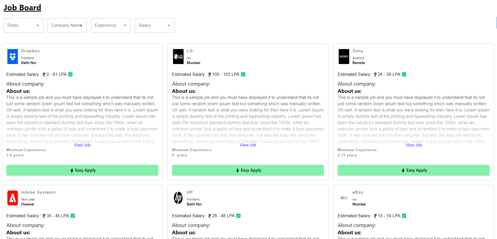

### Deployed link : https://my-candidate-application.vercel.app/

## Main Page

### Run as Development
<pre>
git clone https://github.com/shashwatpal1021/my-candidate-application.git
npm i
npm run dev
</pre>

### Build & Deployment
<pre>
git clone https://github.com/shashwatpal1021/my-candidate-application.git
npm i
npm run build
</pre>

# React + Vite

This template provides a minimal setup to get React working in Vite with HMR and some ESLint rules.

Currently, two official plugins are available:

- [@vitejs/plugin-react](https://github.com/vitejs/vite-plugin-react/blob/main/packages/plugin-react/README.md) uses [Babel](https://babeljs.io/) for Fast Refresh
- [@vitejs/plugin-react-swc](https://github.com/vitejs/vite-plugin-react-swc) uses [SWC](https://swc.rs/) for Fast Refresh
